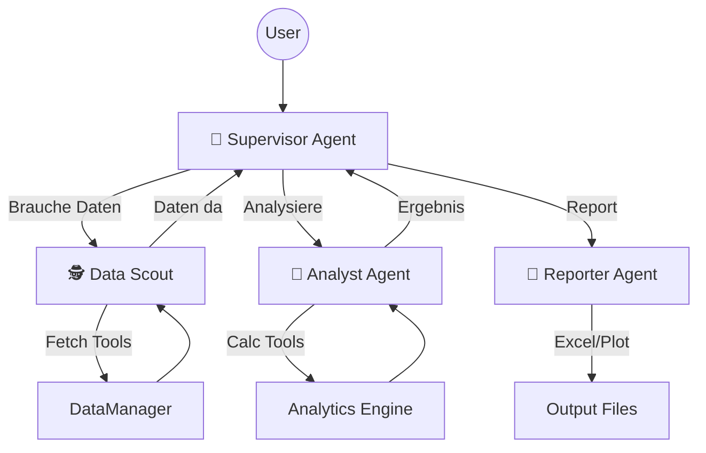

Hier ist das konsolidierte, umfassende Master-Dokument (`MASTER_ARCHITECTURE.md`).

Es vereint die **technische Tiefe** der Projektbibel, die **Vision** der Agenten-Architektur und den **aktuellen Status** aus den Git-Logs. Es ist so strukturiert, dass ein zukünftiger LLM-Co-Architekt den Kontext sofort versteht.

Speichere dies als **`docs/MASTER_ARCHITECTURE.md`**.

---

# 🏛️ MASTER ARCHITECTURE: Agentic Finance Platform

**Version:** 2.0 (Consolidated Standard)
**Datum:** 12.01.2026
**Status:** Phase 1 (Foundation) abgeschlossen | Phase 2 & 3 (Intelligence) gestartet.

---

## 📖 1. Executive Summary & Philosophie

Wir bauen keine monolithische Finanz-Applikation, sondern eine **Agentic Platform**. Das Ziel ist ein System, in dem spezialisierte KI-Agenten autonom komplexe Finanzanalysen durchführen, orchestriert durch eine robuste Python-Infrastruktur.

### Kern-Prinzipien

1. **Separation of Concerns (SoC) - "Layers over Monoliths":**
* **Datenbank & Logik** (Python) verarbeiten Daten.
* **LLMs** (Agenten) treffen Entscheidungen.
* *Regel:* Eine Schicht kommuniziert nur mit der direkten Nachbarschicht.


2. **The "Hot Potato" Data Principle:**
* LLMs sind *Entscheider*, keine *Datenbanken*.
* **Anti-Pattern:** Agent liest 10.000 Zeilen JSON.
* **Pro-Pattern:** Agent ruft Tool `analyze_trend()`. Python lädt Daten in RAM, berechnet Ergebnis, Agent erhält nur `{"trend": "up", "cagr": 0.15}`.


3. **Idempotenz & Stabilität:**
* API-Calls kosten Geld und Zeit. Das System muss "Self-Healing" sein (Lücken füllen) und Duplikate verhindern (`upsert`).


4. **Agent-First Design:**
* Interne APIs geben keine `None` oder `print()` zurück, sondern strukturierte, kontextreiche Objekte (`UpdateResult`), damit der Agent versteht, was passiert ist.


---

## 🏗️ 2. Die 7-Schichten-Architektur (The Stack)

Das System ist vertikal in 7 Schichten unterteilt, von der Rohdaten-Beschaffung bis zur Multi-Agenten-Orchestrierung.

| Layer | Name | Verantwortung | Technologien |
| --- | --- | --- | --- |
| **L7** | **The Swarm** | Orchestrierung, Planung, Delegation. | LangGraph, Supervisor Agent |
| **L6** | **Semantic Memory** | Verknüpfung von unstrukturieren Texten (RAG). | ChromaDB, Embeddings |
| **L5** | **Agent Interface** | Exponierung der Logik als Tools. | LangChain `@tool`, MCP Server |
| **L4** | **Analytics** | Berechnung abgeleiteter Metriken, Visualisierung. | Pandas, Matplotlib, `MetricsCalculator` |
| **L3** | **Business Logic** | Datenfluss-Steuerung, Transaktionen. | `DataManager` (Python) |
| **L2** | **Persistence** | Source of Truth. | SQLite (SQLAlchemy Models) |
| **L1** | **Acquisition** | Externe APIs abstrahieren. | `YFinanceProvider`, Quota Manager |

---

## 🛠️ 3. Infrastruktur Deep Dive (Layers 1-3)

Dies ist das Fundament ("The Engine Room"). Es ist fertiggestellt und getestet (Phase 1C Complete).

### Layer 1: Data Acquisition & Quota

* **Provider Pattern:** Wir nutzen Dependency Injection. Der `DataManager` kennt nur das Interface `DataProviderInterface`.
* **Quota Management:**
* **Local:** `SimpleRateLimiter` (Requests/Sekunde).
* **Global:** `DatabaseQuotaManager` (Requests/Tag). Atomare Zählung in der DB (`ApiQuota`-Tabelle).


* **DTOs:** Daten verlassen L1 nur als standardisierte Data Classes (z.B. `ProviderPriceData`), niemals als rohes JSON.

### Layer 2: Persistence (Database)

* **Schema:** Relationales Modell (`Asset`, `DailyPrice`, `FinancialStatement`, `ApiCallLog`).
* **Idempotenz:** Alle Schreiboperationen nutzen `INSERT ... ON CONFLICT DO UPDATE`.
* **Audit:** Jeder API-Call und jeder Pipeline-Run wird protokolliert (`PipelineRun`).

### Layer 3: The Data Manager (Business Logic)

Dies ist die wichtigste Komponente für die Datenintegrität.

* **Smart Updates:** Prüft `func.max(date)` in der DB, um nur fehlende Daten nachzuladen ("Delta Logic").
* **Agent-Ready Responses:**
Statt `void` Funktionen gibt der Manager reiche Status-Objekte zurück:

```python
@dataclass
class UpdateResult:
    success: bool
    affected_count: int
    entities: List[str]  # Z.B. ["AAPL"]
    error_message: Optional[str] = None
    # Damit weiß der Agent sofort: "Habe 200 Zeilen für AAPL aktualisiert."

```

---

## 🤖 4. Agent Infrastructure (Layers 5-7)

Hier verwandelt sich die Plattform von einem Datenspeicher in ein intelligentes System.

### Layer 5: Tooling (Interface)

* **Data Tools (`src/tools/data_tools.py`):**
* Wrapper um den `DataManager`.
* Input: Pydantic Models (für LLM Schema-Validierung).
* Output: JSON-serialisiertes `UpdateResult`.


* **Trennung:** Tools verarbeiten keine Logik, sie "übersetzen" nur zwischen LLM und Layer 3.

### Layer 6: Semantic Layer (In Planung)

* **Ziel:** Verstehen von Geschäftsberichten (PDFs, News).
* **Komponenten:**
* `DocumentChunk` Tabelle (SQL) für Metadaten.
* Vector Store (ChromaDB) für Embeddings.


* **RAG:** Agenten können semantisch suchen (`"Was sagt der CEO zu KI?"`) statt nur Keyword-Search.

### Layer 7: The Swarm (Multi-Agent System)

Wir nutzen ein **Hierarchisches Supervisor-Pattern** (geplant für Phase 4).



1. **Supervisor:** Hält den State (`messages`), plant Schritte, routet Aufgaben. Hat keine Tools.
2. **Scout:** Der "Jäger". Nutzt `fetch_stock_prices`, `fetch_fundamentals`.
3. **Analyst:** Der "Denker". Nutzt RAG und mathematische Tools (`calculate_metrics`).
4. **Reporter:** Der "Macher". Erstellt Artefakte (Excel, Charts).

---

## ✅ 5. Projekt-Status & Todo

Basierend auf Git-Logs und Diskussionen (Stand: 12.01.2026).

### Abgeschlossen (Phase 1 - Foundation)

* [x] **Architektur:** Clean Code Struktur (`src/portfolio_tool`, `tests`, `docs`).
* [x] **DB Layer:** SQLAlchemy Models, Migrationen, SQLite Setup.
* [x] **L1 Provider:** YFinance Integration mit Quota-System (`MockQuotaManager` & `DatabaseQuotaManager`).
* [x] **L3 Refactoring:** Alle `DataManager` Methoden geben nun `UpdateResult` zurück (Agent-Ready).
* [x] **L5 Tooling:** Erste LangChain Tools implementiert (`fetch_stock_prices`, etc.) und getestet.
* [x] **Testing:** Integrationstests verifizieren, dass Tools echte Daten in die DB schreiben.

### Aktuell (Phase 2 & 3 - Intelligence MVP)

* [ ] **Single Agent MVP:** Erstellung von `simple_agent.py` mit LangGraph, der die bestehenden Tools nutzt.
* [ ] **Analytics Layer (L4):** Implementierung von `Smart Analytics Tools` (z.B. `get_pe_ratio_history`), die Berechnungen *für* den Agenten übernehmen.

### Zukunft (Phase 4 - The Swarm)

* [ ] **RAG Pipeline (L6):** Ingestion von PDF/Text in ChromaDB.
* [ ] **Supervisor Graph:** Implementierung der Multi-Agenten-Logik in LangGraph.
* [ ] **Visualisierung:** Tools für Matplotlib/Plotly Charts.
* [ ] **MCP Server:** Exponierung der Tools für externe Clients (Claude Desktop).

---

## 💡 6. Entwickler-Guide für Erweiterungen

Wenn du (AI oder Mensch) neue Funktionen hinzufügst, folge diesem **7-Schritte-Workflow**:

1. **DB (L2):** Brauchen wir neue Tabellen? -> `models.py` & Alembic Migration.
2. **DTO (L1):** Wie sehen die Daten vom Provider aus? -> `provider_models.py`.
3. **Provider (L1):** Logik zum Abrufen implementieren -> `yfinance_provider.py`.
4. **Manager (L3):** Idempotente `update_`-Methode mit `UpdateResult` schreiben.
5. **Tool (L5):** LangChain `@tool` Wrapper erstellen -> `data_tools.py`.
6. **Test:** Integrationstest schreiben -> `tests/test_tools.py`.
7. **Agent (L7):** Tool dem Agenten-Set hinzufügen.

---

> **Anmerkung für LLMs:** Wenn du an diesem Projekt arbeitest, prüfe immer zuerst `tests/` um die erwarteten Datenstrukturen (`UpdateResult`) zu verstehen. Wir arbeiten **Agent-First**: Strukturiertes Feedback ist wichtiger als Konsolenausgaben.


---
# Zusatzinformationen die eventuell nützlich sind
┌─────────────────────────────────────────────────┐
│                 TECH STACK                      │
├─────────────────────────────────────────────────┤
│  Orchestration:    LangGraph ✅                 │
│  LLM Access:       OpenAI direkt (jetzt)        │
│                    → OpenRouter (später)        │
│  Tools:            LangChain @tool ✅           │
│  Multi-Agent:      LangGraph (Phase 4)          │
└─────────────────────────────────────────────────┘